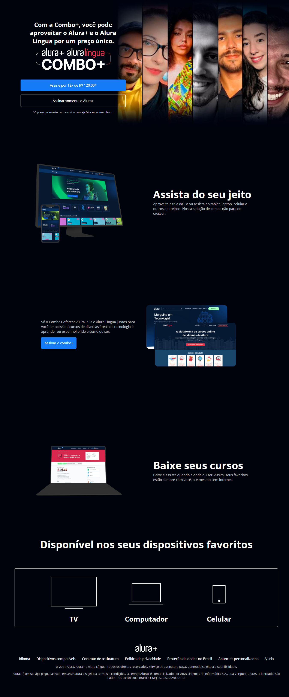

<h1 align="center"> Alura Plus</h1>

    Projeto desenvolvido no curso HTML e CSS: praticando HTML/CSS da Alura

  <a href="#-tecnologias">Tecnologias</a>&nbsp;&nbsp;&nbsp;|&nbsp;&nbsp;&nbsp;
  <a href="#-projeto">Projeto</a>&nbsp;&nbsp;&nbsp;|&nbsp;&nbsp;&nbsp;
 <a href="#memo-licença">Licença</a>

  

 

   #vitrinedev

## 🚀 Tecnologias

Esse projeto foi desenvolvido com as seguintes tecnologias:

- HTML e CSS
- Git e Github

## 💻 Projeto

Construir um site utilizando HTML e CSS.
Identificar elementos e estilos através do Figma.
Aplica os conhecimentos adquiridos até agora em um projeto real.

## :memo: Licença

Esse projeto está sob a licença MIT.

